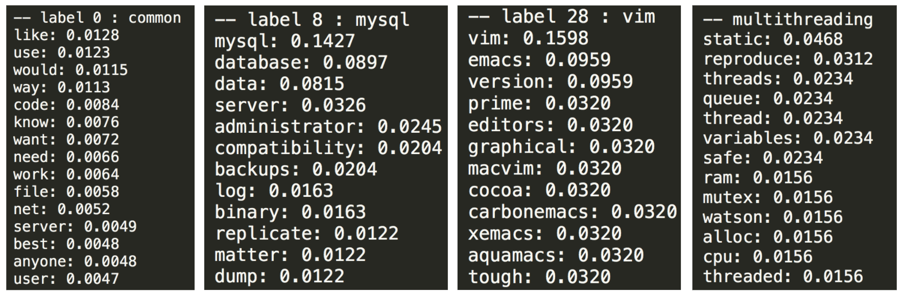
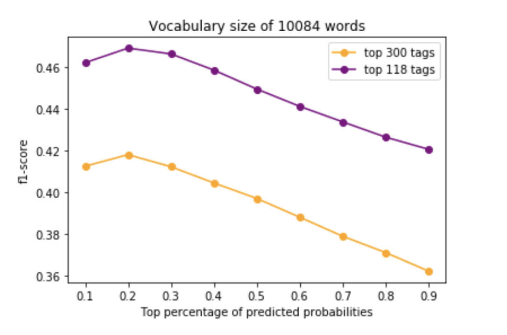

# Tag Suggestion for StackOverflow
We built two models to predict tags for StackOverflow posts:
- A Deep Neural Network trained on the tf-idf vector embeddings of the post
- A Supervised LDA topic model.

Please find the _implementation details and results_ [here](README.pdf)

## Insights from the Supervised LDA model

## Results

